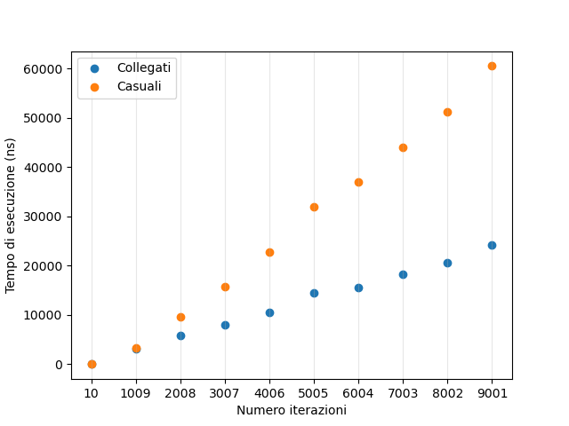

# SLAP 1 - Dimostrare l'esistenza del LAP

Per valutare il comportamento del Load Address Predictor (LAP) sono stati 
implementati due differenti configurazioni di accesso alla memoria, 
corrispondenti a quelle descritti nell'articolo di riferimento:

- Array collegato: ogni elemento punta al successivo con uno stride fisso,
  corrispondente al paramatro S. La sequenza di accessi è quindi perfettamente 
  regolare e prevedibile.
- Array casuale: gli elementi vengono collegati secondo una permutazione 
  casuale degli indici. L'utilizzo di una permutazione garantisce che ogni 
  elemento venga visitato una sola volta, evitando la formazione di cicli di 
  piccola lunghezza che altererebbero il comportamento della misura.

In entrambi i casi gli accessi vengono effettuati tramite puntatori dipendenti
(pointer chasing), introducendo dipendenze Read After Write (RAW) tra accessi
consecutivi e impedendo al processore di eseguire parallelismo a livello di
istruzioni.

La misura della latenza viene eseguita dalla funzione `stride`, che percorre 
completamente la struttura dati due volte:

- Dry run: porta gli indirizzi in cache per eliminare gli effetti non 
  interessanti del prefetching;
- Wet run: misura effettivamente il tempo di esecuzione (e i guadagni) del LAP.

Il tempo restituito corrisponde esclusivamente alla durata della wet run.

Riportiamo il codice della `stride`: 
```c
uint64_t stride(int* in, int ITERS) {
    // array e dep volatili per evitare ottimizzazioni
    volatile int* array = in;
    volatile int dep;

    // effettua la dry run
    dep = 0;
    for (int i = 0; i < ITERS; ++i) {
        dep = array[dep];
    }

    // avvia il timer
    uint64_t start = get_time();

    // effettua la wet run
    dep = 0;
    for (int i = 0; i < ITERS; ++i) {
        dep = array[dep];
    }
    
    // ferma il timer
    uint64_t end = get_time();
    
    // restituisci tempo impiegato dalla wet run
    return end - start;
}
```

Le misure vengono effettuate utilizzando una primitiva ad alta risoluzione 
basata su mach_absolute_time(), convertita in nanosecondi tramite 
mach_timebase_info(). Tale sorgente di tempo è monotona e indipendente dal wall
clock, consentendo misure affidabili di intervalli temporali molto brevi.

L'esperimento viene ripetuto per valori di ITERS compresi tra MIN_ITERS e 
MAX_ITERS, suddivisi in ITERS_STEPS intervalli uniformi.

Per ciascun valore di ITERS vengono effettuate TRIES misure indipendenti sia 
sul pattern collegato sia su quello casuale. Al termine viene calcolata la
media aritmetica dei tempi ottenuti, riducendo l'influenza del rumore 
sperimentale.

I risultati vengono prodotti in formato CSV secondo lo schema:
```csv
    ITERS, linked_time, random_time
```
e successivamente elaborati mediante uno script Python che realizza il seguente
grafico comparativo delle due configurazioni:

